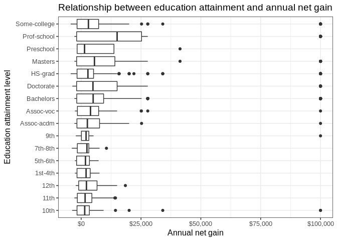
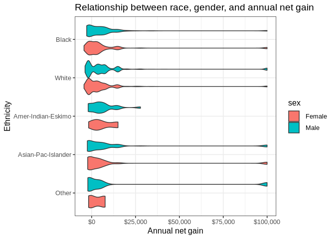
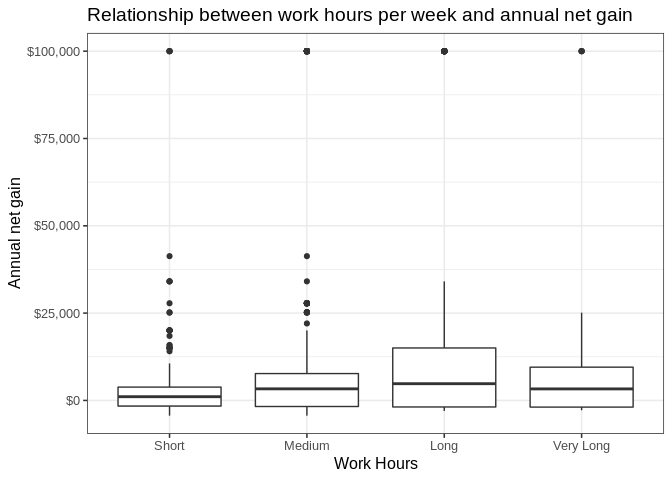

## Introduction 

The economic well-being of individuals is reliant on their income, where income is defined as the money an individual (or household) receives on a regular basis. In the United States, the Census Bureau uses income  (money received before expenses and deductions) to gauge the population's range of poverty, wealth, and financial security (United States Census Bureau, 2016). There are a variety of factors that can influence one's income, including socioeconomic drivers, education and vocation. This project examines some of the variables that are often related to income. 

## Description of Dataset

This project works with a dataset of adult incomes obtained from the University of California Irvine (UCI) [Machine Learning Repository](https://archive.ics.uci.edu/ml/datasets/adult). The data was donated by Ronny Kohavi and Barry Becker (Silicon Graphics) and was originally extracted by Barry Becker from the 1994 Census database and used for machine learning predictions of whether a person makes over $50,000 per year based on personal factors.

This 1994 income census dataset consists of multivariate categorical and integer data that describe socioeconomic and personal classifiers of adults across the USA. Each instance (32,561) is an individual whose annual income was grouped as either above or below $50,000. Table 1 shows an overview of the 15 attributes (variables), including whether each is categorical or integer and a brief interpretation of the variable.  

<br>
<!--html_preserve--><div id="htmlwidget-b9ac8410ec17204b3f58" style="width:100%;height:auto;" class="datatables html-widget"></div>
<script type="application/json" data-for="htmlwidget-b9ac8410ec17204b3f58">{"x":{"filter":"none","caption":"<caption>description of adult income dataset variables<\/caption>","data":[["1","2","3","4","5","6","7","8","9","10","11","12","13","14","15"],["age","workclass","fnlwgt","education","education-num","marital-status","occupation","relationship","race","sex","capital-gain","capital-loss","hours-per-week","native-country","label"],["continuous","categorical","continuous","categorical","continuous","categorical","categorical","categorical","categorical","categorical","continuous","continuous","continuous","categorical","categorical"],["age, range from 17 to 90 (mean 38.58)","Private, Self-emp-not-inc, Self-emp-inc, Federal-gov, Local-gov, State-gov, Without-pay, Never-worked.","\"final weight\" - demographic weight by US state controlled by three sets of characteristics including race/age/sex, hispanic origin, and proportion of state population over 16 years of age","Bachelors, Some-college, 11th, HS-grad, Prof-school, Assoc-acdm, Assoc-voc, 9th, 7th-8th, 12th, Masters, 1st-4th, 10th, Doctorate, 5th-6th, Preschool.","years of education. Range from 1 to 16 (mean 10.08)","Married-civ-spouse, Divorced, Never-married, Separated, Widowed, Married-spouse-absent, Married-AF-spouse.","Tech-support, Craft-repair, Other-service, Sales, Exec-managerial, Prof-specialty, Handlers-cleaners, Machine-op-inspct, Adm-clerical, Farming-fishing, Transport-moving, Priv-house-serv, Protective-serv, Armed-Forces.","Wife, Own-child, Husband, Not-in-family, Other-relative, Unmarried.","White, Asian-Pac-Islander, Amer-Indian-Eskimo, Other, Black.","Female, Male","range from 0 to 99999 (mean 1078). Assuming this is annual financial gains in $USD.","range from 0 to 4356 (mean 87.3). Assuming this is annual financial losses in $USD.","average hours worked per week. Range from 1 to 99 (mean 40.44)","United-States, Cambodia, England, Puerto-Rico, Canada, Germany, Outlying-US(Guam-USVI-etc), India, Japan, Greece, South, China, Cuba, Iran, Honduras, Philippines, Italy, Poland, Jamaica, Vietnam, Mexico, Portugal, Ireland, France, Dominican-Republic, Laos, Ecuador, Taiwan, Haiti, Columbia, Hungary, Guatemala, Nicaragua, Scotland, Thailand, Yugoslavia, El-Salvador, Trinadad&amp;Tobago, Peru, Hong, Holand-Netherlands.","annual income above or below threshold of $50000: &gt;50K or &lt;=50K"]],"container":"<table class=\"display\">\n  <thead>\n    <tr>\n      <th> <\/th>\n      <th>Variable<\/th>\n      <th>Type<\/th>\n      <th>Description<\/th>\n    <\/tr>\n  <\/thead>\n<\/table>","options":{"order":[],"autoWidth":false,"orderClasses":false,"columnDefs":[{"orderable":false,"targets":0}]}},"evals":[],"jsHooks":[]}</script><!--/html_preserve-->
<br>

A couple of assumptions were made about these data based on information on the Census website. It is assumed that "capital gains" indicate non-cash financial benefits (e.g., food stamps, health benefits, subsidized housing or transportation, employer contributions to retirement programs, medical and educational expenses, etc.), and that "capital losses" include non-cash expenses (such as depreciated value of assets). We are also assuming that "education number" indicates the number of years allotted to education.  

It is of note that these data are from 1994 census, and the income threshold of $50,000 held a different meaning for wealth than it holds today. As this dataset includes socioeconomic attributes, it's worth noting that US-born white males comprise the majority of the data instances. 

## Exploratory Data Analysis 

### Load data

```r
# read csv file
dat <- read.csv(here("data/downloaded_datafile"), header = F)

# rename columns
names(dat) <- c("age", "workclass", "fnlwgt", "education", "education-num", "martial_status", 
                "occupation", "relationship", "race", "sex", "capital-gain", "capital-loss", 
                "hours-per-week", "native-country", "label")
```

### Summary overview

```r
summary(dat)
```

```
##       age                    workclass         fnlwgt       
##  Min.   :17.00    Private         :22696   Min.   :  12285  
##  1st Qu.:28.00    Self-emp-not-inc: 2541   1st Qu.: 117827  
##  Median :37.00    Local-gov       : 2093   Median : 178356  
##  Mean   :38.58    ?               : 1836   Mean   : 189778  
##  3rd Qu.:48.00    State-gov       : 1298   3rd Qu.: 237051  
##  Max.   :90.00    Self-emp-inc    : 1116   Max.   :1484705  
##                  (Other)          :  981                    
##          education     education-num                  martial_status 
##   HS-grad     :10501   Min.   : 1.00    Divorced             : 4443  
##   Some-college: 7291   1st Qu.: 9.00    Married-AF-spouse    :   23  
##   Bachelors   : 5355   Median :10.00    Married-civ-spouse   :14976  
##   Masters     : 1723   Mean   :10.08    Married-spouse-absent:  418  
##   Assoc-voc   : 1382   3rd Qu.:12.00    Never-married        :10683  
##   11th        : 1175   Max.   :16.00    Separated            : 1025  
##  (Other)      : 5134                    Widowed              :  993  
##             occupation            relationship                    race      
##   Prof-specialty :4140    Husband       :13193    Amer-Indian-Eskimo:  311  
##   Craft-repair   :4099    Not-in-family : 8305    Asian-Pac-Islander: 1039  
##   Exec-managerial:4066    Other-relative:  981    Black             : 3124  
##   Adm-clerical   :3770    Own-child     : 5068    Other             :  271  
##   Sales          :3650    Unmarried     : 3446    White             :27816  
##   Other-service  :3295    Wife          : 1568                              
##  (Other)         :9541                                                      
##       sex         capital-gain    capital-loss    hours-per-week 
##   Female:10771   Min.   :    0   Min.   :   0.0   Min.   : 1.00  
##   Male  :21790   1st Qu.:    0   1st Qu.:   0.0   1st Qu.:40.00  
##                  Median :    0   Median :   0.0   Median :40.00  
##                  Mean   : 1078   Mean   :  87.3   Mean   :40.44  
##                  3rd Qu.:    0   3rd Qu.:   0.0   3rd Qu.:45.00  
##                  Max.   :99999   Max.   :4356.0   Max.   :99.00  
##                                                                  
##         native-country     label      
##   United-States:29170    <=50K:24720  
##   Mexico       :  643    >50K : 7841  
##   ?            :  583                 
##   Philippines  :  198                 
##   Germany      :  137                 
##   Canada       :  121                 
##  (Other)       : 1709
```

The summary overview provides a snapshot of the data spread and averages. From this, we see this dataset includes a disproportionate number of middle-age, white, US-born, private-sector employees. There appears to be a fairly even distribution of individuals across occupational sectors and the majority of individuals work approximately 40 hours per week.


### Clean data

The summary showed that there are many zero values for capital gains and losses. Because the income in this dataset is binary (above or below $50K) the capital gains and losses appear to be a more interesting metric in gauging wealth for the individuals in the Census. We will filter the data to include only instances when there was a non-zero vlaue for capital gains or losses. 


```r
# remove rows that contain zeroes for both capital gain and loss and merge capital-gain and capital-loss into a single variable, net
dat.filt <- dat %>% 
  filter(`capital-gain` != `capital-loss`) %>% 
  mutate(net = if_else(`capital-gain` == 0, 
                       as.numeric(`capital-loss`)*-1, # transform capital-loss to negative values 
                       as.numeric(`capital-gain`)))

# remove leading white spaces
dat.filt$race <- trimws(dat.filt$race)

# convert race to a factor
dat.filt$race <- factor(dat.filt$race, c("Other", "Asian-Pac-Islander", "Amer-Indian-Eskimo", "White", "Black"))
```

### Filtered summary overview

Here we can view the filtered data summary and see that by filtering by capital gains and losses, the demographic has shifted to slightly older individuals represented by more men than women. 


```r
summary(dat.filt)
```

```
##       age                    workclass        fnlwgt       
##  Min.   :17.00    Private         :2714   Min.   :  19302  
##  1st Qu.:34.00    Self-emp-not-inc: 413   1st Qu.: 118346  
##  Median :42.00    Local-gov       : 321   Median : 175669  
##  Mean   :43.18    Self-emp-inc    : 284   Mean   : 187152  
##  3rd Qu.:51.00    ?               : 181   3rd Qu.: 234292  
##  Max.   :90.00    State-gov       : 164   Max.   :1033222  
##                  (Other)          : 154                    
##          education    education-num                  martial_status
##   HS-grad     :1086   Min.   : 1.00    Divorced             : 453  
##   Bachelors   : 971   1st Qu.: 9.00    Married-AF-spouse    :   2  
##   Some-college: 758   Median :10.00    Married-civ-spouse   :2777  
##   Masters     : 423   Mean   :11.03    Married-spouse-absent:  35  
##   Prof-school : 213   3rd Qu.:13.00    Never-married        : 769  
##   Assoc-voc   : 188   Max.   :16.00    Separated            :  81  
##  (Other)      : 592                    Widowed              : 114  
##               occupation           relationship                  race     
##   Prof-specialty   :850    Husband       :2454   Other             :  23  
##   Exec-managerial  :847    Not-in-family : 878   Asian-Pac-Islander: 137  
##   Sales            :512    Other-relative:  71   Amer-Indian-Eskimo:  31  
##   Craft-repair     :506    Own-child     : 258   White             :3755  
##   Adm-clerical     :362    Unmarried     : 274   Black             : 285  
##   Machine-op-inspct:196    Wife          : 296                            
##  (Other)           :958                                                   
##       sex        capital-gain    capital-loss    hours-per-week 
##   Female: 992   Min.   :    0   Min.   :   0.0   Min.   : 1.00  
##   Male  :3239   1st Qu.:    0   1st Qu.:   0.0   1st Qu.:40.00  
##                 Median : 3137   Median :   0.0   Median :40.00  
##                 Mean   : 8293   Mean   : 671.9   Mean   :43.42  
##                 3rd Qu.: 7688   3rd Qu.:1740.0   3rd Qu.:50.00  
##                 Max.   :99999   Max.   :4356.0   Max.   :99.00  
##                                                                 
##         native-country    label           net       
##   United-States:3850    <=50K:1781   Min.   :-4356  
##   ?            :  90    >50K :2450   1st Qu.:-1740  
##   Mexico       :  31                 Median : 3137  
##   Philippines  :  24                 Mean   : 7622  
##   India        :  21                 3rd Qu.: 7688  
##   Germany      :  20                 Max.   :99999  
##  (Other)       : 195
```

### Relationship between education attainment and annual net gain

```r
# generate boxplot of annual net gain across education levels
dat.filt %>% 
  ggplot(aes(x = education, y = net)) +
  geom_boxplot() +
  coord_flip() +
  scale_y_continuous(labels = scales::dollar_format()) +
  theme_bw(12) +
  labs(x = "Education attainment level",
       y = "Annual net gain",
       title = "Relationship between education attainment and annual net gain")
```

<!-- -->

From the above boxplot, there seems to be minimal correlation between annual net gain and education attainment, however there seems to be a greater spread in annual net gain for individuals with at least a high school diploma. Professional school education demonstrated the highest median in annual net gain.

### Relationship between race, gender and annual net gain

```r
# generate violin plots of annual net gain across race and gender
dat.filt %>% 
  ggplot(aes(x = race,
             y = net, fill = sex)) +
  geom_violin() +
  coord_flip() +
  scale_y_continuous(labels = scales::dollar_format()) +
  theme_bw(12) +
  labs(x = "Ethnicity",
       y = "Annual net gain",
       title = "Relationship between race, gender, and annual net gain")
```

<!-- -->

From the above violin plot, there doesn't appear to be any significant differences in annual net gain between sex across all ethnic groups. Moreover, no obvious correlation between ethncity and annual net gain can be observed.

### Correlation between work hours per week and annual net gain

```r
# generate a box plot of annual net gain across work hours
dat.filt %>% 
  mutate(`work hours` = factor(case_when(`hours-per-week` <= 25 ~ "Short", # define a new variable to bin work hours per week into 4 categories
                                  `hours-per-week` > 25 & `hours-per-week` <= 50 ~ "Medium",
                                  `hours-per-week` > 50 & `hours-per-week` <= 75 ~ "Long",
                                  TRUE ~ "Very Long"),
                               levels = c("Short", "Medium", "Long", "Very Long"))) %>% 
  ggplot(aes(x = `work hours`, y = net)) +
  geom_boxplot() +
  theme_bw(12) +
  guides(fill = F) +
  scale_y_continuous(labels = scales::dollar_format()) +
  labs(x = "Work Hours",
       y = "Annual net gain",
       title = "Relationship between work hours per week and annual net gain")
```

<!-- -->

From the above boxplot, there appears to be an increase in annual net gain from short to long work hours. However, the differences may not be significant because greater variance in annual net gain is observed for individuals with long work hours.

## Research Questions

In this study, we will explore the relationships between personal attributes and quantitative income-related variables with the goal of identifying relationships and interesting patterns. Specifically, we will focus on addressing the following exploratory research questions: 

1. Is there an observable relationship between personal attributes data and income level?
2. Does the number of hours worked per week relate more to occupation, sex, race, age, or is there no clear relationship?
3. What is the relationship between education and hours worked per week (e.g. does a person work fewer hours if they have completed more schooling)?

## Plan of Action

The variables that effect income may be confounding and are unlikely to be direct, therefore these data may not be appropriate for linear regression analyses. We will focus on exploring the relationships variables and identifying relationships and patterns. 


## References

United States Census Bureau, 2016. Income and Poverty, 'about income'. https://www.census.gov/topics/income-poverty/income/about.html

University of California Irvine, Machine Learning Repository. https://archive.ics.uci.edu/ml/datasets/adult.
